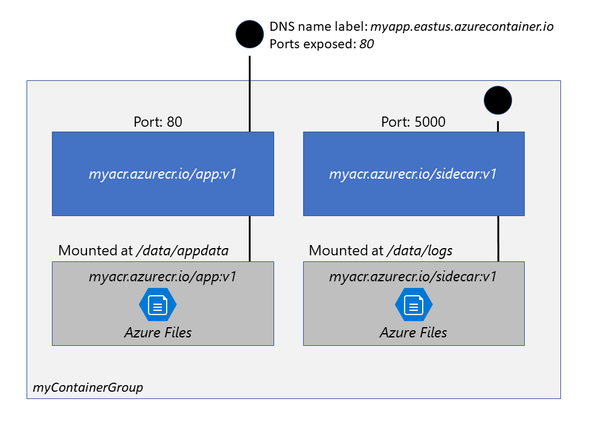

**Learning path link: [AZ-204: Implement containerized solutions](https://learn.microsoft.com/en-us/training/paths/az-204-implement-iaas-solutions/)**

*Methodology: For each learning objective in each module, write a short summary demonstrating knowledge matching the objective as learned in the course.*

## Post-course review

*Course notes by module start below*

<hr/>

## Module 1: Manage container images in Azure Container Registry

#### Learning Objectives

- Explain the features and benefits Azure Container Registry offers
- Describe how to use ACR Tasks to automate builds and deployments
- Explain the elements in a Dockerfile
- Build and run an image in the ACR by using Azure CLI

### Container Registry Features and Benefits
- Managed container registry service based on open source Docker Registry 2.0
- Used to manage and store container images and related artifacts
- Can be used weith existing pipelines, or can use Container Registry Tasks to uild container images in Azure
- On demand or full automation with triggers available

#### Use Cases:
- Scalable orchestration systems that manage containerized applications across clusters of hosts including K8s, DC/OS and Docket Swarm
- Azure services that support building and running apps at scale inlcuding Azure K8s Service (AKS), App Service, Batch, Service Fabric

Devs can push to a container registry as part of a container development workflow using a CI tool like Azure Pipelines.

> Configure ACR Tasks to automatically rebuild application images when their base images are updated, or automate image builds when your team commits code to a Git repository. Create multi-step tasks to automate building, testing, and patching multiple container images in parallel in the cloud.

Service tiers:
- Basic: Cost optimized entrypoint for learning. Same capabilities as bigger plans, with lower includede storage and image throughput. 
- Standard: Same capabilities as Basic, with increased included storage and image throughput. Good for most.
- Premium: Highest storage, image throughput and concurrent operations. 

When images are grouped in repo, each image is a read-only snapshot of a Docker-compatible containery. Can be Windows or Linux. Stores related content formats like Helm charts as well.

ACR tasks can be used to streamline buidling, testing, publishing and deploying to Azure. 

> Configure build tasks to automate your container OS and framework patching pipeline, and build images automatically when your team commits code to source control.

**Capabilities |**
- Encryption at rest
- Regional storage (helps meet data residency and compliance requirements), geo replication available
- Geo replication available in premium registries. Guard against regional failure, network-close for faster push/pulls in development
- Zone redundancy in Premium tier, uses Azure AZs to replicate registry to 3 zones in each region
- Can create as many repos, images, layers, tags as needed up to registry storage limit, though large numbers of those can impact performance

### ACR Tasks to automate builds and deployments

ACR Tasks:
- Provide cloud-based container image building for Linux, Windows and ARM
- Extend early parts of app development cycle to cloud with on-demand container image builds
- Enable automatic builds triggered by source code updates, updates to base images or timers

> Each ACR Task has an associated source code context - the location of a set of source files used to build a container image or other artifact. Example contexts include a Git repository or a local filesystem.

Task scenarios:
- Quick task: build and publish a single container image to a container on demand, in Azure without needing a local Docker. (Like `docker build`, `docker push` for the cloud)
  - Verify your automated build definitions and catch potential problems before committing your code
  - Offloading your container image builds to Azure
- Automatically triggered tasks: build image on source code update, base image update or on schedule
  - Source code update: use Azure CLI command `az acr task create` and specify a Git repository and optionally a branch and Dockerfile
  - Base image update: Build application images when base image changes in the registry or a public repo
  - Schedule: Timer triggers on a defined schedule
- Multi-step task: Extend a single image build and push capability with multi step, multi container workflows. These are defined in a YAML file. Example automation: 
  1. Build a web application image
  2. Run the web application container
  3. Build a web application test image
  4. Run the web application test container, which performs tests against the running application container
  5. If the tests pass, build a Helm chart archive package
  6. Perform a `helm` upgrade using the new Helm chart archive package

Can use the platform tag to build Windows images or linux imgages for other architectures like `--platform Linux/arm64/v8`. Options:
- Linux: AMD64, Arm, Arm64, 386
- Windows: AMD64

### Elements in a Dockerfile
> A Dockerfile is a script that contains a series of instructions that are used to build a Docker image

They include the following info:
- Base or parent image to create the new image
- COmmands to update the base OS or install other software
- Build artifacts to include, like a developed application
- COmmand to run when container is launched

**Sample .NET Dockerfile |**

```Dockerfile
# Use the .NET 6 runtime as a base image
FROM mcr.microsoft.com/dotnet/runtime:6.0

# Set the working directory to /app
WORKDIR /app

# Copy the contents of the published app to the container's /app directory
COPY bin/Release/net6.0/publish/ .

# Expose port 80 to the outside world
EXPOSE 80

# Set the command to run when the container starts
CMD ["dotnet", "MyApp.dll"]
```

### Build and run an image using Azure CLI
**Create a container registry |**
Create resource group: `az group create --name az204-acr-rg --location <myLocation>`
Create Basic tier container registry: `az acr create --resource-group az204-acr-rg --name <myContainerRegistry> --sku Basic`

**Build and push image from Dockerfile |**
Create a docker file based on MS hello-world image: `echo FROM mcr.microsoft.com/hello-world > Dockerfile`
Build image and push to registry: `az acr build --image sample/hello-world:v1 --registry <myContainerRegistry> --file Dockerfile .`

**Verify results |**
List repos in registry: `az acr repository list --name <myContainerRegistry> --output table`
List tags on the repository: `az acr repository show-tags --name <myContainerRegistry> --repository sample/hello-world --output table`

**Run image in the ACR |**
Run container image from your container registry: `az acr run --registry <myContainerRegistry> --cmd '$Registry/sample/hello-world:v1' /dev/null`
`--cmd` parameter above runs container in default config, but supports other docker run params or other docker commands.

**Clean up |**
Delete rg: `az group delete --name az204-acr-rg --no-wait`


## Module 2: Run container images in Azure Container Instances

#### Learning Objectives

- Describe the benefits of Azure Container Instances and how resources are grouped
- Deploy a container instance in Azure by using the Azure CLI
- Start and stop containers using policies
- Set environment variables in your container instances
- Mount file shares in your container instances

### Benefits of Azure Container Instances 
> Azure Container Instances (ACI) offers the fastest and simplest way to run a container in Azure, without having to manage any virtual machines and without having to adopt a higher-level service.
Benefits:
- Start containers in seconds
- Expose container groups to internet with IP address and fully qualified domain name
- Isolate as completely as it would be in VM (security)
- ACI stores minimum customer data required to ensure container groups run as expected
- Persistent storage for Azure File shares mounted to container
- Use same API for both Windows and Linux

Azure Kubernetes Service is reccomended if full container orchestration across multiple containers is needed.

Top level resource in ACI is a container group, which contains sontainers scheduled on same host machine. Containers in group share lifecycle, resources, local network and storage.

Example container group with multiple containers:


- Is scheduled on a single host machine.
- Is assigned a DNS name label.
- Exposes a single public IP address, with one exposed port.
- Consists of two containers. One container listens on port 80, while the other listens on port 5000.
- Includes two Azure file shares as volume mounts, and each container mounts one of the shares locally.


### Deploy an instance with Azure CLI

### Start and stop containers with policies

### Set env variables in container instances

### Moint file shares in container instances