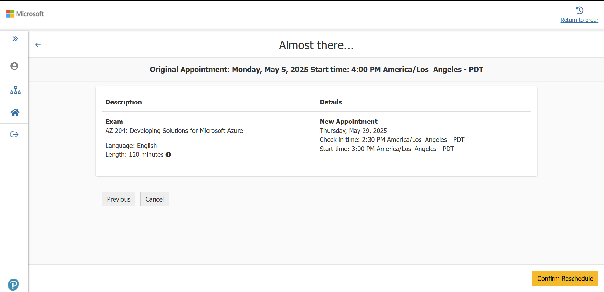

**Name:** Derek Watson
**Course:** CSPB 3112: Professional Development in Computer Science

# Final Report: AZ-204 Certification Learning Journey Blog

## 1. Introduction

The original goal of my project was to complete [Microsoft’s exam preparation curriculum](https://learn.microsoft.com/en-us/credentials/certifications/azure-developer/?practice-assessment-type=certification) for the AZ-204: Azure Developer Associate certification. My plan was to work through one “learning path” each week over the course of the semester, culminating in the 120-minute certification exam at the end. This would provide a tangible achievement to showcase my efforts. Over the course of the semester, I have utilized additional training materials to try and improve my engagement and interest by changing the learning medium, and changed the order in which I completed the posts. I have reprinted the original schedule and goals below:

### Original Goals / Assessments
1. Is there a blog post completed for each of the course modules listed above?
2. Does the blog have a homepage and links to all posts?
3. Do the blog posts convey key information covered in the course as well as personal insights?
4. Did I take the certification exam by week 15? Success or failure?

## 2. Background

I chose this project because the organization where I work as a developer is currently migrating nearly all of its software and applications to Azure, transitioning away from self-hosted and AWS solutions. As a result, I expected to gain highly relevant and practical knowledge. Additionally, certifications like this one are valuable tools for validating skills, not only to current employers but also to future opportunities and act as a complement to other academic credentials and professional experience. I have taken similar exams on AWS before and while I found them helpful to learn the platform, I also found them to be much easier then the Azure equivalents. This sentiment is echoed throughout the internet when searching the topic.

It is also important to note is that I am working full time and have a family with two small children (ages 1 and 3) and a working spouse, so it was often times challenging to find as much time to dedicate to this project as I had hoped, even given the long time frame. That being said, I did complete posts for every single topic in the original Microsoft Learn curriculum, even if in the end I still don't quite feel ready to take the exam. More on that in the results and discussion sections. 

## 3. Methodology, Materials and Methods

My original plan was to follow the curriculum from the **Microsoft Learn curriculum1** mentioned in the introduction section of this report. That curriculum had 12 "Learning Paths" each covering a different set of related services on Azure's cloud that are applicable to developers on the platform. I have reprinted my original schedule below:

#### Original Schedule:
| Week #      | Goal                                                          |
|-------------|---------------------------------------------------------------|
| Week 0      | Project ideation, no post                                     |
| Week 1      | Project ideation, no post                                     |
| Week 2      | Set up basic site/blog, Post: Project Proposal                |
| Week 3      | Post: AZ-204: Implement Azure App Service web apps            |
| Week 4      | Post: AZ-204: Implement Azure Functions                       |
| Week 5      | Post: AZ-204: Develop solutions that use Blob storage         |
| Week 6      | Post: AZ-204: Develop solutions that use Azure Cosmos DB      |
| Week 7      | Post: AZ-204: Implement containerized solutions               |
| Week 8      | Post: AZ-204: Implement user authentication and authorization |
| Week 9      | Post: AZ-204: Implement secure Azure solutions                |
| Week 10     | Post: AZ-204: Implement API Management                        |
| Spring Brk. | N/A                                                           |
| Week 11     | Post: AZ-204: Develop event-based solutions                   |
| Week 12     | Post: AZ-204: Develop message-based solutions                 |
| Week 13     | Post: AZ-204: Troubleshoot solutions by using Application Insights |
| Week 14     | Post: AZ-204: Implement caching for solutions                 |
| Week 15     | Study for/take certification exam                             |
| Finals Week | Post: Exam experience and results                             |

Of course, things did not go exactly accoding to plan. 

The monotony and repetitiveness of the Microsoft Learn content started to weigh on my enthusiasum later on in the semester, so I utilized the access we have to LinkedIn Learning to supplement that material with a **video course from Microsoft Press2** which I found to be more engaging, though perhaps not thorough enough as I learned later. Even using the video course however, I still followed the same 12-post structure and wrote a post for each and every topic in the original schedule (plus one bonus post). The order of the posts changed, and I did get slighly behind at one point resulting in multiple posts in one week, but I made it through all of the content. You can see all of the posts with dates on [my blog](https://derek-watson14.github.io/azure-blog-cspb-3112/)4 if you want to see how reality compared to the original schedule.

The final resource I used came very late in the process (just last week), and was a **prep course with lots of practice exams and questions3** created by MeasureUp, which was offered to purchase as an add-on when I registered for the exam with Microsoft. My biggest regret of the course is not accessing this resource sooner, more on that later.

## 4. Results

In the end I think I did learn a ton about Azure over the course of this project. The AZ-204 exam covers a very broad range of services that I would like to enumerate below for effect:

1. Azure App Service
2. Azure Functions
3. Azure Storage Accounts
4. Azure Cosmos DB
5. Azure Container Apps
6. Azure Container Registry
7. Azure Container Instances
8. Azure API Management
9. Azure Event Grid
10. Azure Event Hub
11. Azure Service Bus
12. Azure Queue Storage
13. Azure Application Insights
14. Azure Cache For Redis
15. Azure CDN
16. Azure Key Vault
17. Microsoft Identity Platform
18. Microsoft Graph

Of those 18 services, I have worked with only eight in the past. Each has its own SKUs, SDKs and large set of features. In short, this was A LOT of new information. I think the best summary of what I learned for each service can be found in the individual posts, where I wrote a "Post-lesson review" each time, highlighting what I thought of the course and how it could be applicable to my work.

I have actually already applied some of the things I have learned in this course to the infrastructure for my organization. Particularly auto-scaling rules, lifecycle policies, authorization and key vault best practices and alerts based on App Insight metrics are topics that have already come in handy building services on Azure for my organization. So one of my major goals for this project was a success (improving my knowledge of Azure cloud to be more valuable at work), the other part (completing the certification) has not been.

Let's see how I did on each project assessment one by one:

1. Is there a blog post completed for each of the course modules listed above?
*YES. I did write a post and complete coursework for every module in the original schedule.*

2. Does the blog have a homepage and links to all posts?
*YES. The blog has a homepage and links to all posts. See link 4 in the references section.*

3. Do the blog posts convey key information covered in the course as well as personal insights?
*YES. All posts thoroughly cover the module information and include detailed notes as well as a section about my personal thoughts and insights gained from that particular module.

4. Did I take the certification exam by week 15? Success or failure?
*NO. I did not take the certification by Week 15. I had it scheduled for May 5th, but had to reschedule as I did not think I would pass after working through the practice exams in my MeasureUp course. See screenshot below and more details on this in the next section.*

## 5. Discussion / Reflection

So, as mentioned in the section above, I met **3/4 goals** in my assessment criteria, but the one I missed was perhaps the biggest of the four. 

My main stumbling block was waiting too long to start taking practice exams. I did not want to start exhausting my bank of practice questions until I had completed all of the material, so I chose to wait to do any practice exams (including the free ones from Microsoft) until I had finished all the posts and coursework. This proved to be a big mistake as once I took the practice exams, I realized the exams were much more in depth than AWS certs I have taken in the past.

They included a lot of questions about specific methods and classes of the C# SDKs for each service and questions about the differences between available SKUs/tiers for each service. They also were not just straight forward multiple choice, but included case studies, drag and drop sequencing and questions where all answers look like they could be correct unless you know the exact syntax/method names in the service's SDK or CLI. 

The first practice exam I took last week I got a 66%. To pass the real exam you need to score 700/1000 and the real exam is much harder than the practice versions. When I (optimistically) scheduled my exam for 5/5/2025 I added the MeasureUp practice exams to my purchase and trying one of those is really what opened my eyes to how difficult the exam would be.

If I were to do this entire process again, I would start doing practice exams much earlier in the process then I did so that I would know I needed to pay close attention to details about SKUs, SDKs and consider case study questions while working through material. 

As of writing this post I have decided to reschedule my exam for later this month, at which time this semester will unfortunately be over. I am optimistic I can pass the exam by the end of May 2025 (which is my stated goal at work), but I am not optimistic that I can pass the exam *tomorrow*.

## 6. Conclusion

Although I didn’t achieve all of my original goals (namely, sitting for the exam during the semester), I consider this project a success. I completed the entire AZ-204 curriculum, created a comprehensive learning blog, and identified specific gaps in my knowledge to address going forward. This process has made me a stronger developer and helped bridge the gap between academic learning and industry certifications. I now feel well-equipped to pass the AZ-204 exam in the near future and will continue using the blog format for future certifications and professional growth.

## 7. References
1. Original Microsoft Course: [Microsoft Certified: Azure Developer Associate](https://learn.microsoft.com/en-us/credentials/certifications/azure-developer/?practice-assessment-type=certification)
2. Microsoft Press Course, LinkedIn Learning: [Microsoft Azure Developer Associate (AZ-204) Cert Prep by Microsoft Press](https://www.linkedin.com/learning/microsoft-azure-developer-associate-az-204-cert-prep-by-microsoft-press)
3. Final Exam Preparation, MeasureUp: [Microsoft Practice Test AZ-204: Developing Solutions for Microsoft Azure](https://www.measureup.com/microsoft-practice-test-az-204-developing-solutions-for-microsoft-azure.html)
4. Course Blog Link: [Azure AZ-204: Developer Associate certification blog](https://derek-watson14.github.io/azure-blog-cspb-3112/)
